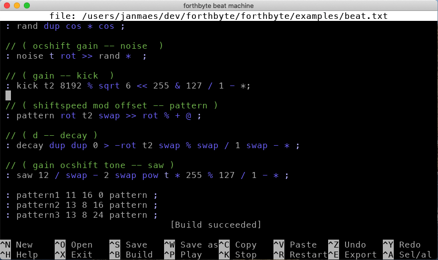

# forthbyte
Bytebeat and floatbeat machine.

Bytebeat is a type of music made from mathematical formulas, first discovered by [Viznut](http://viznut.fi/en/) in 2011.
The idea is that `t` represents a timer, infinitely increasing. In most cases `t` increases 8000 times per second (for a 8000Hz bytebeat song), but you can also let `t` represent a 44100Hz timer if you like.
If you take the next formula with a 8000Hz timer

    t | (t >> 4)
    
then a bytebeat generator will compute the above formula 8000 times per second for the corresponding value of `t`. Next the result (which can be a large value) is brought back to 8 bit by only retaining the remainder of the integer division by 256. This 8-bit value is sent to the speakers. The above formula sounds like [this](https://greggman.com/downloads/examples/html5bytebeat/html5bytebeat.html#t=0&e=0&s=8000&bb=5d000001000c00000000000000003a080b8211271601699e47dc7a96bdeefffe47b000).

Floatbeat is very similar to bytebeat. The difference is that the formula can use floating point (decimal) computations, and the result is expected to be in the interval `[-1, 1]`. Again this value is reworked to a 8-bit value and sent to the speakers. The advantage of floatbeat is that it is more natural here to work with sine and cosine functions. The next formula with a 44100Hz timer

    sin(440*t*3.1415926535*2/44100)

generates a 440Hz tone, like [this](https://greggman.com/downloads/examples/html5bytebeat/html5bytebeat.html#t=1&e=0&s=44100&bb=5d000001001f0000000000000000399a4a1a8961f80549b689502166e2852d12e851ce4a54854c282dd601f86f25b2bfffd47d0000).

There are already a bunch of very nice bytebeat and floatbeat generators available, such as
- [Greggman's html5bytebeat](https://github.com/greggman/html5bytebeat)
- [Viznut's IBNIZ](http://pelulamu.net/ibniz/)
- [Wurstcaptures](http://wurstcaptures.untergrund.net/music/)
- [Rampcode](https://github.com/gabochi/rampcode)
- probably many others

Forthbyte is my attempt at generating a bytebeat and floatbeat machine using a dialect of the language Forth. If you want to try it out, you can take a look at some examples in the examples subfolder.

Screenshot
----------

[Session on YouTube](https://www.youtube.com/watch?v=_Cy9dza6NlI)

Building
--------
First of all, forthbyte uses submodules, so don't forget to also call

     git submodule update --init

Next, run CMake to generate a solution file on Windows, a make file on Linux, or an XCode project on MacOs.
You can build forthbyte without building other external projects (as all necessary dependencies are delivered with the code). 

Editor commands
---------------

^A        : Select all

^B        : Build the current buffer. If you are playing, the new compiled song will continue playing.

^C        : Copy to the clipboard (pbcopy on MacOs, xclip on Linux)            

^E        : Whenever you play, the song is recorded on disk to a wav file. With this command you can set the output file. If not set by ^E, the default output file is session.wav in your forthbyte binaries folder.

^N        : Make an empty buffer

^P        : Play / pause

^H        : Show tis help text

^K        : Stop playing

^O        : Open a file

^R        : Restart the timer `t`

^S        : Save the current file

^W        : Save the current file as 

^V        : Paste from the clipboard (pbpaste on MacOs, xclip on Linux)

^X        : Exit this application, or cancel the current operation

^Y        : Redo

^Z        : Undo

Glossary
--------

### Preprocessor directives

`#byte` use bytebeat

`#float` use floatbeat (this is the default)

`#samplerate nr` set the sample rate (default value is 8000)

`#initmemory a b c ... ` initializes the memory with the values given by `a`, `b`, `c`, ... . There are 256 memory spots available.

### Predefined variables

`t` the timer

`sr` the current samplerate that was set by the preprocessor directive `#samplerate`

`c` the current channel. It's possible to use stereo. The left channel has a value of `c` equal to 0, and the right channel has a value equal to 1.

### Forth words

The Forth stack has 256 entries. If you go over this amount, the counter resets to zero, so you never can get a stack overflow. Similar for the memory entries, or the Forth return stack.

`+` ( a b -- c ) Pops the two top values from the stack, and pushes their sum on the stack.

`-` ( a b -- c )  Pops the two top values from the stack, and pushes their subtraction on the stack.

`*` ( a b -- c )  Pops the two top values from the stack, and pushes their multiplication on the stack.

`/` ( a b -- c )  Pops the two top values from the stack, and pushes their division on the stack.

`<<` ( a b -- c )  Pops the two top values from the stack, and pushes their left shift on the stack.

`>>` ( a b -- c )  Pops the two top values from the stack, and pushes their right shift on the stack.

`&` ( a b -- c )  Pops the two top values from the stack, and pushes their binary and on the stack.

`|` ( a b -- c )  Pops the two top values from the stack, and pushes their binary or on the stack.

`^` ( a b -- c )  Pops the two top values from the stack, and pushes their binary xor on the stack.

`%` ( a b -- c )  Pops the two top values from the stack, and pushes their modulo on the stack.

`<` ( a b -- c )  Pops the two top values from the stack, compares them with `<`, and puts 0 on the stack if the comparison fails, 1 otherwise.

`>` ( a b -- c )  Pops the two top values from the stack, compares them with `>`, and puts 0 on the stack if the comparison fails, 1 otherwise.

`<=` ( a b -- c )  Pops the two top values from the stack, compares them with `<=`, and puts 0 on the stack if the comparison fails, 1 otherwise.

`>=` ( a b -- c )  Pops the two top values from the stack, compares them with `>=`, and puts 0 on the stack if the comparison fails, 1 otherwise.

`=` ( a b -- c )  Pops the two top values from the stack, compares them with `=`, and puts 0 on the stack if the comparison fails, 1 otherwise.

`<>` ( a b -- c )  Pops the two top values from the stack, compares them with `<>` (not equal), and puts 0 on the stack if the comparison fails, 1 otherwise.

`@` ( a -- b ) Pops the top value from the stack, gets the value at memory address `a`, and pushes this value on the stack.

`!` ( a b -- ) Pops the two top values from the stack, and stores value `a` at memory address `b`.

`>r` ( a -- ) Pops the top value from the stack, and moves it to the return stack. The return stack has 256 entries.

`r>` ( -- a ) Pops the top value from the return stack, and moves it to the regular stack. 

`: ;` Define a new word, e..g. `: twice 2 * ;` defines the word `twice`, so that `3 twice` equals `3 2 *` equals `6`.

`abs` ( a -- b ) Pops the top value from the stack, and pushes the absolue value on the stack.

`atan2` ( a b -- c ) Pops the two top values from the stack, and pushes atan2(a, b) on the stack.

`ceil` ( a -- b ) Pops the top value from the stack, rounds the value up, and pushes this value on the stack.

`cos` ( a -- b ) Pops the top value from the stack, and pushes the cosine on the stack.

`drop` ( a -- )  Pop the top element of the stack.

`dup` ( a -- a a )  Duplicate the value on the top of the stack.

`2dup` ( a b -- a b a b ) Duplicate the top two elements on the stack.

`exp` ( a -- b ) Pops the top value from the stack, and pushes the exponential on the stack.

`floor` ( a -- b ) Pops the top value from the stack, rounds the value down, and pushes this value on the stack.

`log` ( a -- b ) Pops the top value from the stack, and pushes the logarithm on the stack.

`max` ( a b -- c ) Pops the two top values from the stack, and pushes their maximum on the stack.

`min` ( a b -- c ) Pops the two top values from the stack, and pushes their minimum on the stack.

`negate` ( a -- b ) Pops the top value from the stack, and pushes the negative value on the stack.

`nip` ( a b -- b )  Drop the first item below the top of the stack.

`not` ( a -- b ) Pops the top value from the stack, and pushes the binary not on the stack.

`over` ( a b -- a b a )  Duplicate the element under the top stack element.

`pick` ( a_b ... a_1 a_0 b -- a_b ... a_1 a_0 a_b )  Remove b from the stack and copy a_b to the top of the stack.

`pow` ( a b -- c ) Pops the two top values from the stack, and pushes `a` to the power `b` on the stack.

`rot` ( a b c -- b c a ) Rotate the three top elements on the stack.

`-rot` ( a b c -- c a b ) Reverse rotate the three top elements on the stack.

`sin` ( a -- b ) Pops the top value from the stack, and pushes the sine on the stack.

`sqrt` ( a -- b ) Pops the top value from the stack, and pushes the square root on the stack.

`swap` ( a b -- b a ) Swaps the two top positions on the stack.

`tan` ( a -- b ) Pops the top value from the stack, and pushes the tangent on the stack.

`tuck` ( a b -- b a b )  Copy the top stack item below the second stack item.
